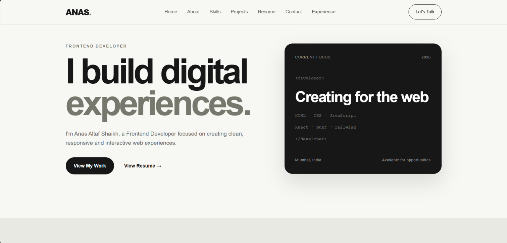
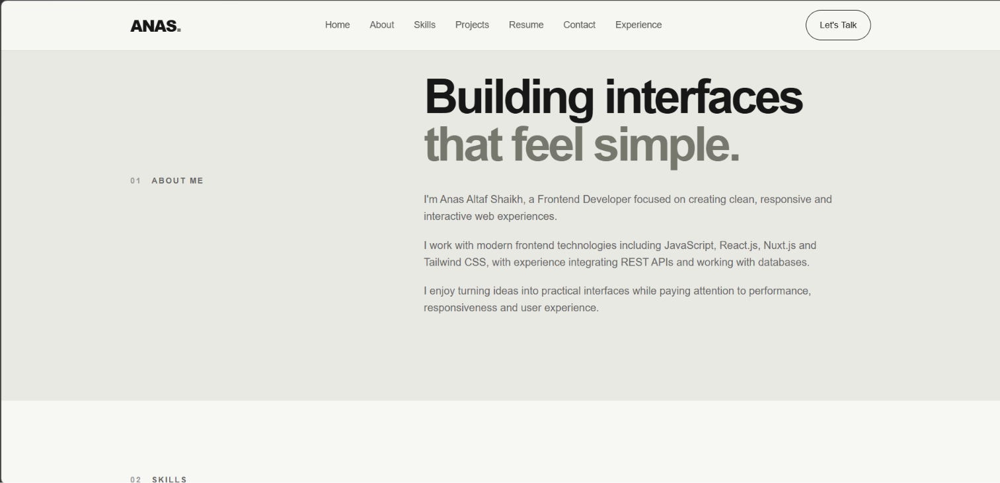
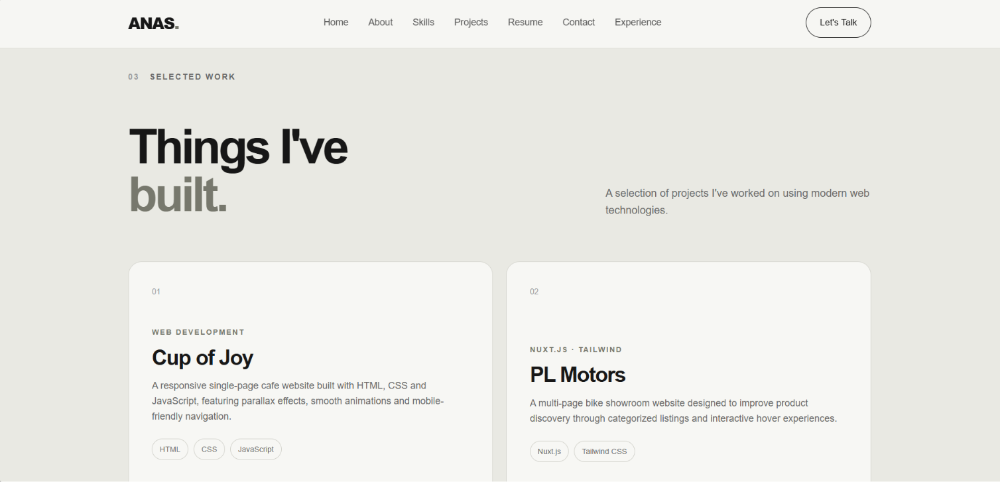
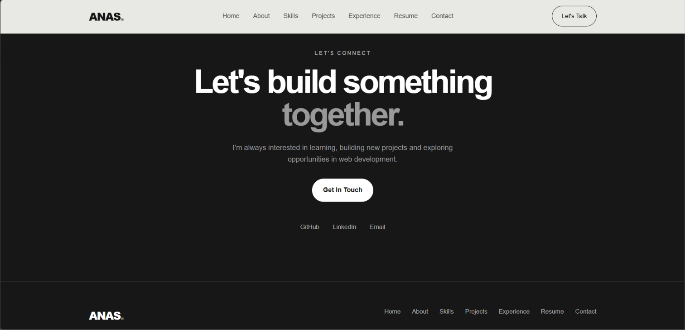

# Personal Portfolio Website

A responsive personal portfolio website built to showcase my skills,
projects, education, experience and contact information as a Frontend Developer.

## 🚀 Live Preview

Add your deployed website link here.

## 📌 About

This portfolio was created as part of the OASIS INFOBYTE Web Development
Internship.

The website focuses on a clean, minimal and responsive design while
presenting my frontend development skills and selected projects.

## ✨ Features

- Responsive design for desktop, tablet and mobile
- Mobile navigation menu
- Smooth scrolling navigation
- About Me section
- Skills section
- Projects showcase
- Experience & Education section
- Resume download
- GitHub and LinkedIn links
- Contact section
- Accessible navigation controls

## 🛠️ Technologies Used

- HTML5
- CSS3
- JavaScript
- Responsive Web Design
- Git
- GitHub

## 📂 Projects

### Cafe Website

A responsive single-page cafe website featuring modern layouts,
animations and mobile-friendly navigation.

### PL Motors

A multi-page bike showroom website built using Nuxt.js and Tailwind CSS.

[View Repository](https://github.com/Kirito0051/P.L-Motors)

### Travel Tales

A travel booking interface featuring flight, hotel and car rental
modules with 3D visual elements.

[View Repository](https://github.com/Kirito0051/Travel_Tales)

### Product Inventory System

A web application using the FakeStore API with dynamic product
listings, search, sorting and price filtering.

[View Repository](https://github.com/Kirito0051/Product-Inventory-System)

## 📱 Screenshots

### Home

### About

### Projects

### Contact

## 📄 Resume

My resume is available directly from the portfolio through the
**Download Resume** button.

## 🔗 Connect

**GitHub:**  
https://github.com/Kirito0051

**LinkedIn:**  
https://www.linkedin.com/in/anas-shaikh-110ab12bb/

**Email:**  
anas0066@gmail.com

## 👨‍💻 Author

Anas Altaf Shaikh

Frontend Developer
